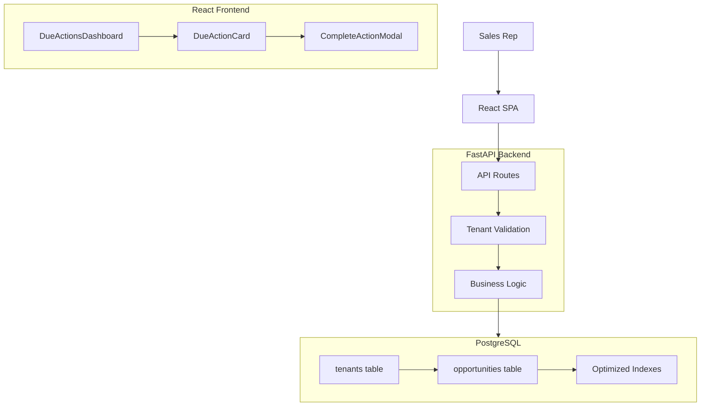

# Design Document - Next Action Tracker (NAT)

## Overview

The Next Action Tracker (NAT) is a focused dashboard application designed to prevent pipeline leakage in Sales CRM systems. The system consists of a React frontend, FastAPI backend, and PostgreSQL database, implementing a multi-tenant architecture with tenant-based data isolation.

The core workflow ensures that every sales opportunity maintains forward momentum by requiring sales representatives to immediately define the next action when completing the current one.

## Architecture

### System Architecture



### Technology Stack

- **Frontend**: React 18+ with TypeScript, React Query for server state management
- **Backend**: FastAPI with Python 3.11+, Pydantic for validation
- **Database**: PostgreSQL 15+ with timezone support
- **Deployment**: Docker Compose for local development

## Components and Interfaces

### Database Schema

#### Tenants Table
```sql
CREATE TABLE tenants (
    id UUID PRIMARY KEY DEFAULT gen_random_uuid(),
    name TEXT NOT NULL,
    created_at TIMESTAMPTZ DEFAULT NOW()
);
```

#### Opportunities Table
```sql
CREATE TABLE opportunities (
    id UUID PRIMARY KEY DEFAULT gen_random_uuid(),
    tenant_id UUID NOT NULL REFERENCES tenants(id),
    name TEXT NOT NULL,
    value INTEGER,
    stage TEXT NOT NULL,
    next_action_at TIMESTAMPTZ,
    next_action_details TEXT,
    last_activity_at TIMESTAMPTZ NOT NULL DEFAULT NOW(),
    created_at TIMESTAMPTZ DEFAULT NOW(),
    updated_at TIMESTAMPTZ DEFAULT NOW()
);

-- Critical index for NAT dashboard performance
CREATE INDEX idx_opportunities_tenant_due 
ON opportunities (tenant_id, next_action_at) 
WHERE next_action_at IS NOT NULL;
```

### API Endpoints

#### GET /api/v1/opportunities/due
**Purpose**: Retrieve all due actions for the NAT dashboard

**Headers**: 
- `X-Tenant-ID`: UUID (required)

**Response**: Array of opportunity objects with due actions

**Query Logic**:
```sql
SELECT id, name, value, stage, next_action_at, next_action_details 
FROM opportunities
WHERE tenant_id = :tenant_id
  AND next_action_at IS NOT NULL
  AND next_action_at <= NOW()
ORDER BY next_action_at ASC;
```

#### POST /api/v1/opportunities/{opportunity_id}/complete_action
**Purpose**: Complete current action and set next action

**Headers**: 
- `X-Tenant-ID`: UUID (required)

**Request Body**:
```json
{
    "new_next_action_at": "2025-11-10T10:00:00Z",
    "new_next_action_details": "Send customized contract"
}
```

**Update Logic**:
```sql
UPDATE opportunities
SET 
    next_action_at = :new_next_action_at,
    next_action_details = :new_next_action_details,
    last_activity_at = NOW(),
    updated_at = NOW()
WHERE id = :opportunity_id AND tenant_id = :tenant_id;
```

### Frontend Components

#### DueActionsDashboard Component
- **State Management**: Uses React Query `useQuery` for server state
- **Loading States**: Skeleton loader during data fetch
- **Error Handling**: Error boundary with retry functionality
- **Empty State**: "All done! 🎉" when no due actions

#### DueActionCard Component
- **Props**: Opportunity data (id, name, value, stage, next_action_details)
- **Actions**: "Complete Action" button that opens modal
- **Display**: Formatted opportunity information with clear action details

#### CompleteActionModal Component
- **Form Fields**: 
  - DatePicker for new action date (required)
  - TextArea for action description (required)
- **Validation**: Client-side validation before submission
- **Mutation**: Uses React Query `useMutation` for API call
- **UX**: Disabled submit during loading, error display on failure

## Data Models

### Opportunity Model (Pydantic)
```python
class OpportunityBase(BaseModel):
    name: str
    value: Optional[int] = None
    stage: str
    next_action_at: Optional[datetime] = None
    next_action_details: Optional[str] = None

class OpportunityCreate(OpportunityBase):
    pass

class OpportunityUpdate(BaseModel):
    new_next_action_at: datetime
    new_next_action_details: str

class Opportunity(OpportunityBase):
    id: UUID
    tenant_id: UUID
    last_activity_at: datetime
    created_at: datetime
    updated_at: datetime
```

### Tenant Isolation Strategy

**Light Implementation Approach**:
- All API endpoints require `X-Tenant-ID` header
- Database queries filtered by `tenant_id` in WHERE clauses
- No row-level security (RLS) for simplicity
- Validation middleware ensures tenant_id presence

**Security Considerations**:
- Current approach is demo-suitable but IDOR-vulnerable
- Production would require JWT-based authentication
- Consider PostgreSQL RLS for additional security layer

## Error Handling

### Backend Error Responses
- **400 Bad Request**: Invalid input data (Pydantic validation)
- **404 Not Found**: Opportunity not found or wrong tenant
- **422 Unprocessable Entity**: Business logic violations
- **500 Internal Server Error**: Database or system errors

### Frontend Error Handling
- **Network Errors**: Retry mechanism with exponential backoff
- **Validation Errors**: Field-level error display
- **API Errors**: Toast notifications with error details
- **Loading States**: Skeleton loaders and disabled buttons

### Error Logging
```python
# Structured logging for action completions
logger.info(
    "Action completed",
    extra={
        "tenant_id": tenant_id,
        "opportunity_id": opportunity_id,
        "action_type": "complete_action",
        "timestamp": datetime.utcnow().isoformat()
    }
)
```

## Testing Strategy

### Backend Testing
- **Unit Tests**: Business logic validation, data model tests
- **Integration Tests**: API endpoint testing with test database
- **Database Tests**: Query performance and constraint validation

### Frontend Testing
- **Component Tests**: React Testing Library for UI components
- **Integration Tests**: User workflow testing with MSW mocking
- **E2E Tests**: Critical path testing with Playwright

### Test Data Strategy
- **Seed Script**: Creates demo tenants and opportunities
- **Test Fixtures**: Reusable test data for consistent testing
- **Database Cleanup**: Automated cleanup between test runs

## Performance Considerations

### Database Optimization
- **Primary Index**: `idx_opportunities_tenant_due` for dashboard queries
- **Query Optimization**: Filtered index excludes NULL next_action_at
- **Connection Pooling**: FastAPI with asyncpg for efficient connections

### Frontend Optimization
- **React Query Caching**: Automatic background refetch and caching
- **Component Optimization**: React.memo for expensive renders
- **Bundle Optimization**: Code splitting for reduced initial load

### Scalability Bottlenecks
- **Current Limitation**: No pagination on /due endpoint
- **Mitigation Strategy**: Cursor-based pagination for >1000 opportunities
- **Monitoring**: Track P95 latency on critical endpoints

## Deployment Architecture

### Development Environment
```yaml
# docker-compose.yml structure
services:
  db:
    image: postgres:15
    environment:
      - POSTGRES_DB=nat_dev
  
  backend:
    build: ./backend
    depends_on: [db]
    environment:
      - DATABASE_URL=postgresql://...
  
  frontend:
    build: ./frontend
    depends_on: [backend]
    ports: ["3000:3000"]
```

### Environment Configuration
- **Database**: PostgreSQL with timezone support
- **Backend**: FastAPI with uvicorn ASGI server
- **Frontend**: React development server with proxy to backend